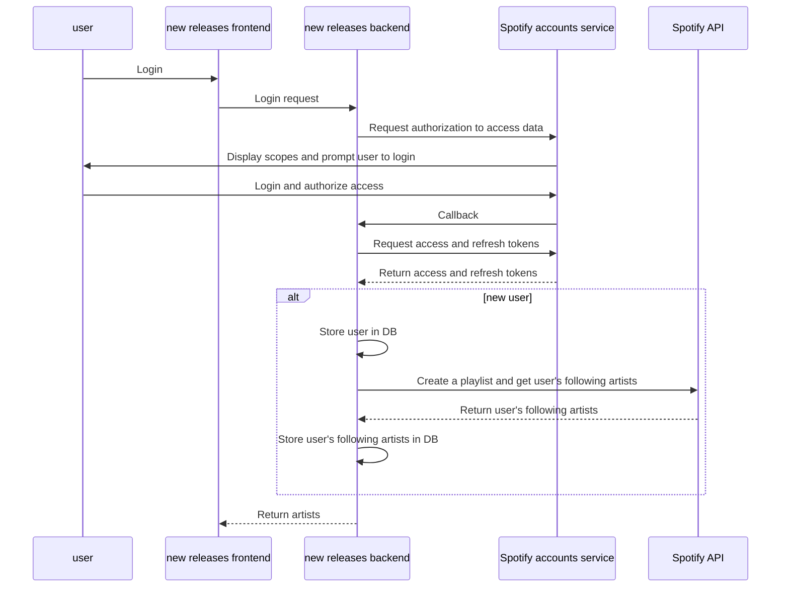
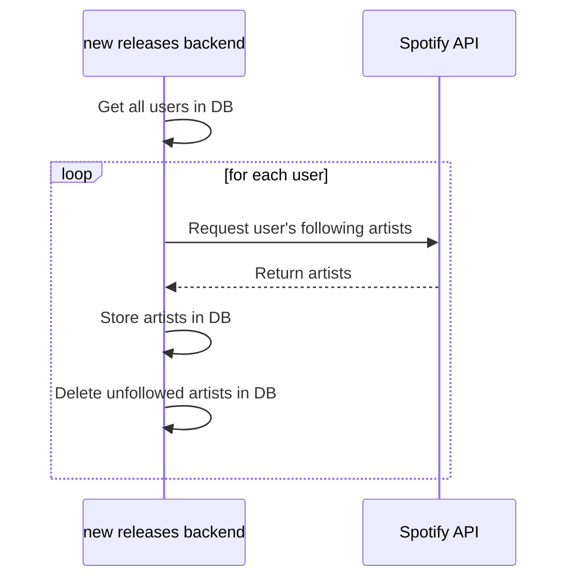
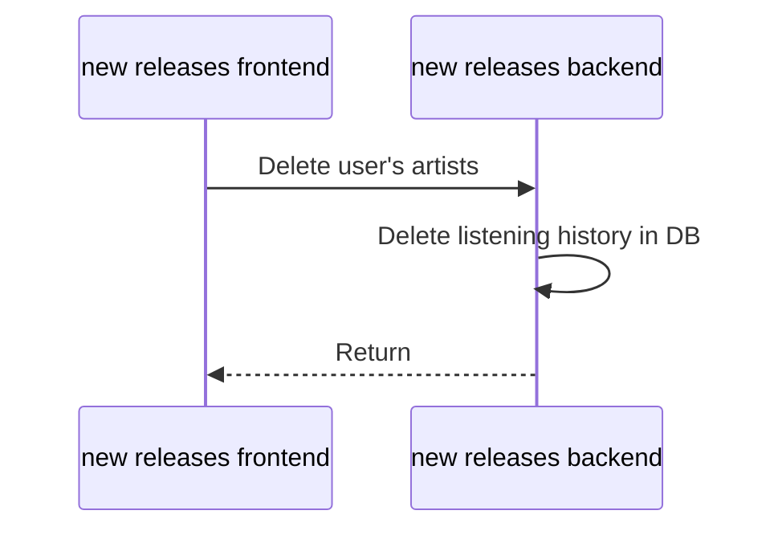
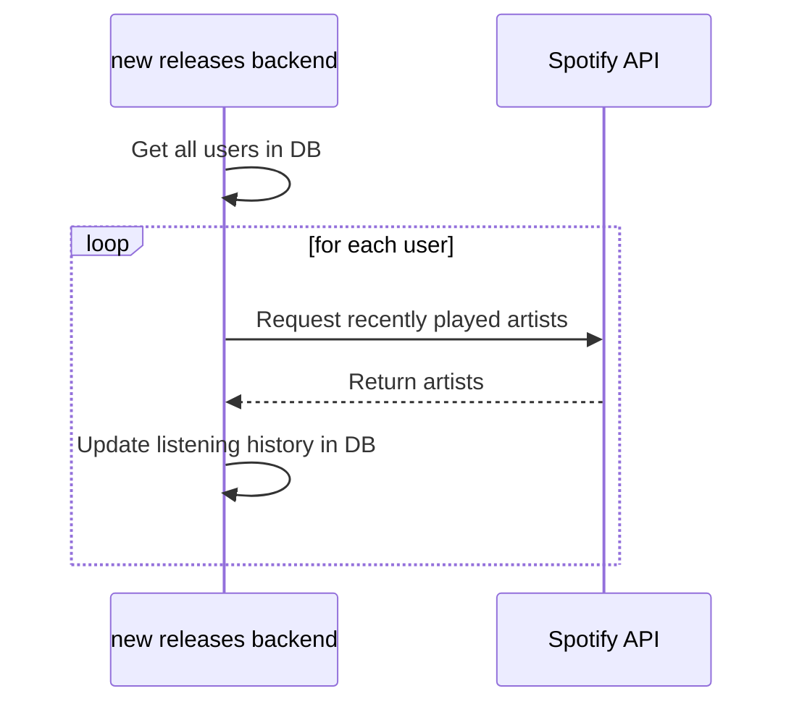
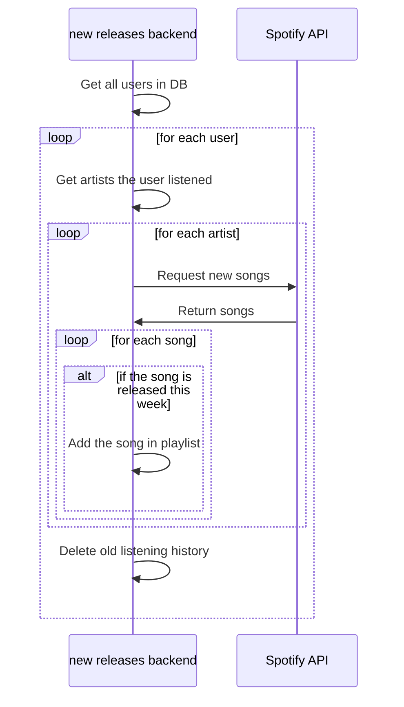

# Architecture

## /login

```mermaid
sequenceDiagram
	user ->> new releases frontend: Login
	new releases frontend ->> new releases backend: Login request
	new releases backend ->> Spotify accounts service: Request authorization to access data
	Spotify accounts service ->> user: Display scopes and prompt user to login
	user ->> Spotify accounts service: Login and authorize access
	Spotify accounts service ->> new releases backend: Callback
	new releases backend ->> Spotify accounts service: Request access and refresh tokens
	Spotify accounts service -->> new releases backend: Return access and refresh tokens
	alt new user
new releases backend ->> new releases backend: Store user in DB
		new releases backend ->> Spotify API: Create a playlist and get user's following artists
		Spotify API -->> new releases backend: Return user's following artists
		new releases backend ->> new releases backend: Store user's following artists in DB
	end
	new releases backend -->> new releases frontend: Return artists
```

## /user

```mermaid
sequenceDiagram
	new releases backend ->> new releases backend: Get all users in DB
	loop for each user
		new releases backend ->> Spotify API: Request user's following artists
		Spotify API -->> new releases backend: Return artists
		new releases backend ->> new releases backend: Store artists in DB
		new releases backend ->> new releases backend: Delete unfollowed artists in DB
	end
```

## /delete

```mermaid
sequenceDiagram
    new releases frontend ->> new releases backend: Delete user's artists
    new releases backend ->> new releases backend: Delete listening history in DB
    new releases backend -->> new releases frontend: Return
```

## /setting

```mermaid
sequenceDiagram
    new releases frontend ->> new releases backend: Delete user's artists
    new releases backend ->> new releases backend: Delete listening history in DB
    new releases backend -->> new releases frontend: Return
```

## /setting/save

```mermaid
sequenceDiagram
	new releases frontend ->> new releases backend: Delete user's artists
	new releases backend ->> new releases backend: Delete listening history in DB
	new releases backend -->> new releases frontend: Return
```

## Update listening history

```mermaid
sequenceDiagram
	new releases backend ->> new releases backend: Get all users in DB
	loop for each user
		new releases backend ->> Spotify API: Request recently played artists
		Spotify API -->> new releases backend: Return artists
		new releases backend ->> new releases backend: Update listening history in DB
	end
```

## Update playlist

```mermaid
sequenceDiagram
	new releases backend ->> new releases backend: Get all users in DB
	loop for each user
		new releases backend ->> new releases backend: Get artists the user listened
		loop for each artist
			new releases backend ->> Spotify API: Request new songs
			Spotify API ->> new releases backend: Return songs
			loop for each song
				alt if the song is released this week
					new releases backend ->> new releases backend: Add the song in playlist
				end
			end
		end
		new releases backend ->> new releases backend: Delete old listening history
	end
```

## Update user's following

```mermaid
sequenceDiagram
	new releases backend ->> new releases backend: Get all users in DB
	loop for each user
		new releases backend ->> Spotify API: Request user's following artists
		Spotify API -->> new releases backend: Return artists
		new releases backend ->> new releases backend: Store artists in DB
		new releases backend ->> new releases backend: Delete unfollowed artists in DB
	end
```