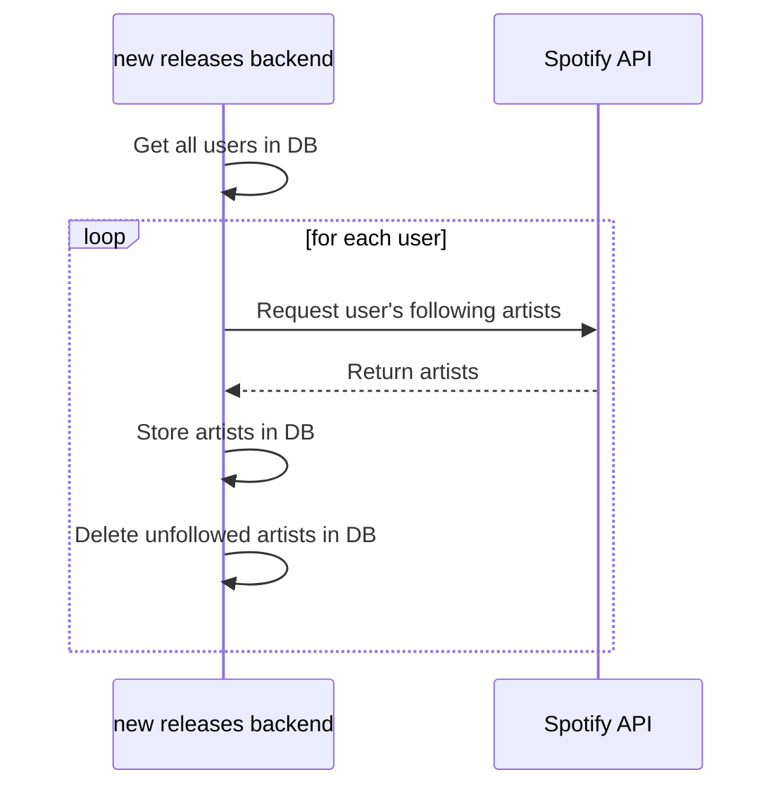
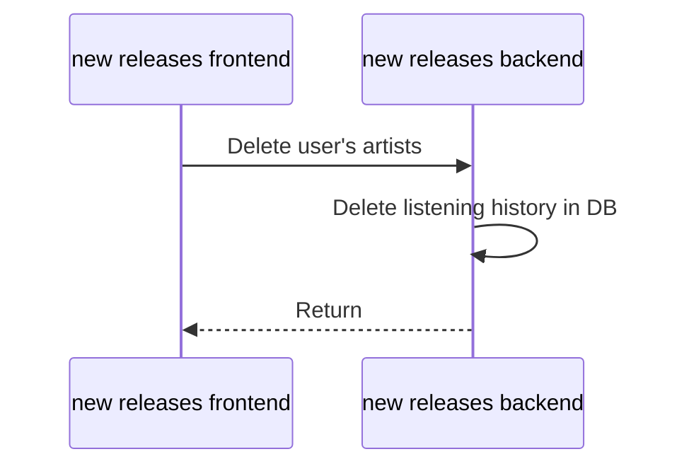

# Architecture

## /login



## /user


## /delete



## /setting

```marmaid
sequenceDiagram
    new releases frontend ->> new releases backend: Delete user's artists
    new releases backend ->> new releases backend: Delete listening history in DB
    new releases backend -->> new releases frontend: Return
```

## /setting/save

```marmaid
sequenceDiagram
	new releases frontend ->> new releases backend: Delete user's artists
	new releases backend ->> new releases backend: Delete listening history in DB
	new releases backend -->> new releases frontend: Return
```

## Update listening history

```marmaid
sequenceDiagram
	new releases backend ->> new releases backend: Get all users in DB
	loop for each user
		new releases backend ->> Spotify API: Request recently played artists
		Spotify API -->> new releases backend: Return artists
		new releases backend ->> new releases backend: Update listening history in DB
	end
```

## Update playlist

```marmaid
sequenceDiagram
	new releases backend ->> new releases backend: Get all users in DB
	loop for each user
		new releases backend ->> new releases backend: Get artists the user listened
		loop for each artist
			new releases backend ->> Spotify API: Request new songs
			Spotify API ->> new releases backend: Return songs
			loop for each song
				alt if the song is released this week
					new releases backend ->> new releases backend: Add the song in playlist
				end
			end
		end
		new releases backend ->> new releases backend: Delete old listening history
	end
```

## Update user's following

```marmaid
sequenceDiagram
	new releases backend ->> new releases backend: Get all users in DB
	loop for each user
		new releases backend ->> Spotify API: Request user's following artists
		Spotify API -->> new releases backend: Return artists
		new releases backend ->> new releases backend: Store artists in DB
		new releases backend ->> new releases backend: Delete unfollowed artists in DB
	end
```